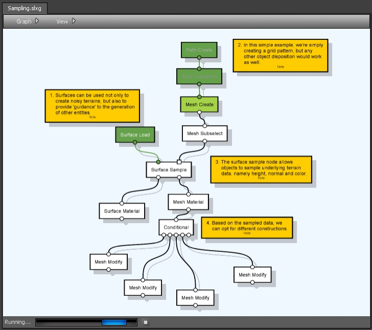
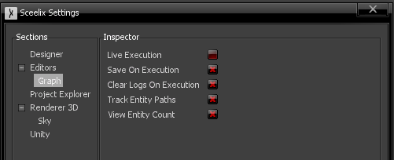

# Graph Editor

The graph editor is one of the available file editors and one of Sceelix’s core interface element. It is displayed inside the [Document Area](DocumentArea) and handles files with the **.slxg** extension.

## Controls

This is the control used to view and edit graphs, which appears in the Document Window:

* **Left-Mouse click:** Selection of nodes, edges, ports and presentation of graph properties.
* **Right-Mouse click:** Context menu for graph and selection.
* **Middle-Mouse press or Left + Shift while moving mouse:** Camera panning.
* **Mouse Scroll Wheel:**  Camera zoom in and out.
* **F:** zoom on a node selection or on the full graph (if nothing is selected).
* **Alt+Left Mouse click:** When pressed on edges and ports, toggles between states (enabled, disabled, etc.)

## Settings

You can change the graph editor settings through the graph editor’s menu -> View->Settings. These could also be accessed through the application top-most menu->Application->Settings and looking under Editors->Graph.

For now, the following settings are available:

* **Live Execution:** If enabled, every change made to a graph being edited will force a graph re-execution. Note that only changes that might contribute to a change in the result will be considered (for instance, changing the label of a node will not trigger an execution). While this option is useful to quickly see the results of the graph being edited, for longer and more work-intensive graphs the process may not be desired, especially if the graph execution becomes more CPU-intensive.
* **Save on Execution:** If enabled, the graph will be saved every time, before it is executed. Enabled by default.
* **Clear Logs on Execution:** If enabled, all entries in the [log window](LogViewer) will be cleared when the graph is executed.
* **Track Entity Paths:** If enabled, tracking information about the nodes, edges and ports that an entity has gone through will be registered. This will enable coloring of the nodes that led to creation of a given entity, once it is selected in the [Data Explorer](DataExplorer) or any other viewer. This is very useful to understand the nodes that contributed to the creation of an entity, when it is selected, but can carry a significant performance overhead for more complex graphs.
* **View Entity Count:** If enabled, it will show, at each port, how many entities have come in (for input ports) or come out (for output ports) in the last graph execution.