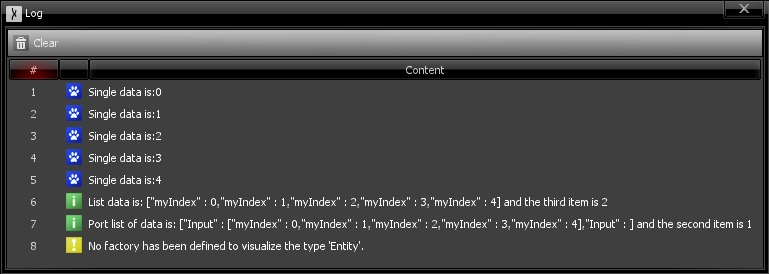

# Log Viewer

The log window displays all kinds of debug, warning, error or otherwise important information.

Logs messages can be sent by any other Sceelix window. In addition to their textual message content, they are identified by their type: information, debug, warning and error. Each type features its own indicative icon, as shown in the image above. Messages are displayed in the order in which they are sent.

Error messages usually encompass more details about the source and reason for the event. In such cases, hovering the log message will show more details in a tooltip. Such details are also written to the [application logs](../Setting%20Up/Logging).

In some cases, double-clicking a message will trigger an action that will allow its exact origin to be traced back. Such is the case for graph nodes: double-clicking the message will zoom on the node that issued it, which can be of great help when troubleshooting problems.

The contents of the log window can be cleared at any moment using the button “Clear” at the window top menu. Other windows can also issue commands to clear the windows. Such is the case of the [graph editor](GraphEditor), if the option “Clear Logs on Execution” is checked in the Sceelix Settings.