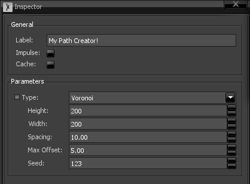

# Parameters

Parameters are the means to control what a node does with (or without) their input entities. They are accessible in the inspector window when a node is selected.

## Types

There are parameters of several _types_ such as integers, strings, floating-point, file paths, vectors, lists, etc. These are commonly found in most programming languages:

 * **Int**: A integer number.
 * **Bool**: A boolean value - either _true_ or _false_.
 * **Float**: A floating-point number, with a maximum of 6 decimal case precision.
 * **Double**: A float-point number, with a maximum of 15 decimal case precision.
 * **String**: A textual value, consisting of a string of characters.
 * **List**: A composition of any of the basic types above, or of other lists. A list can hold items of the same type (like [1,4,6]) or several types (like [45,"Hello",true,10.0]). Lists can be associative, meaning that each list item has a key (like ["Name" : "John", "Age" : 20, "Married", false]).
 * **Object**: A C# object that contains any of the above types or other objects. Sceelix's native libraries include the following object types:
   * **Vector2**: An object with float fields X,Y for positioning and direction calculation in 2D space.
   * **Vector3**: An object with float fields X,Y,Z for positioning and direction calculation in 3D space.
   * **Color**: An object with byte fields R,G,B,A (all integers in the 0-255 range) that describes a RGB color with Alpha/transparency component.

## Editors

For the same type of parameters, there are sometimes more than one available _editor_. For example, both a textbox and a multi-choice selection box could be used to write text strings.

These are the basic parameter _types_:

 * **Attribute**
 * compound: A composition of
 * color: A compound value that holds color information, namely Red, Green, Blue and Alpha.
 * list
 * object
 * vector2d
 * vector3d

And these are the available _controls_ that work on the available types:

 * Int: A numeric spin control for introducing integer values. Produces values of type Int
 * bool: A checkbox control that accepts only integer numbers.
 * float: A numeric spin control that accepts floating-point numbers, with a maximum of 6 decimal case precision.
 * double
 * string
 * attribute
 * color
 * compound
 * list
 * object
 * optional
 * select
 * choice
 * file
  * folder
  * vector2d
  * vector3d

## Expressions

Parameters can be assigned fixed values but also mathematical _expressions_. Click on a parameter label to change the control to 'Expression'.

You can use math functions and arithmetic operations. A popup window will list existing functions.

It is important to match the type of value to the parameter type. Still, if you write in a string and the type is float, the value will be converted automatically.

## Graph Parameters

You can also define "global" graph parameters and reference them in the nodes.

You can access them by left-clicking anywhere on the back graph canvas, which will display them in the inspector window. Alternatively, the right-click context menu or the top menu (Graph->Properties) will lead you to the same place.

[Image] 

Parameters are _immutable_, meaning that they cannot be changed throughout the graph. They work as global constants that can work as a single point of definition. If you are reusing the same value in several nodes, you could reference a global graph parameter. This way, you could change the actual value in a single location and all its references would be updated.

[Image]

When a node parameter is in expression mode, a button with a "+" sign becomes available. This allows the quick creation of a new graph parameter. By default, the popup window that appears will suggest one with the same (or similar) name, type and default value, but you could change these. When accepted, a reference to the parameter will be added to the expression textbox.

[Image]