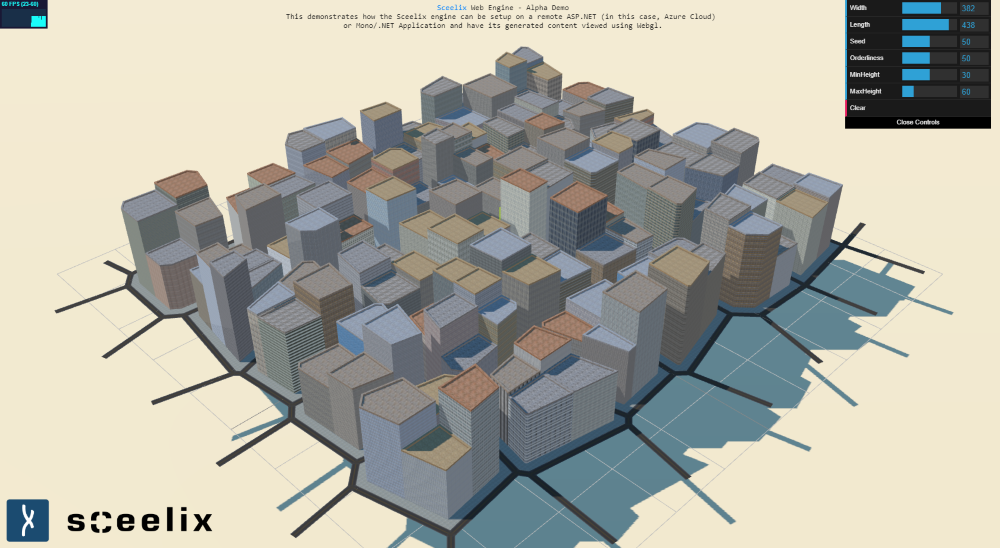
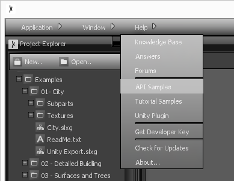

# Developing an External Application

One of Sceelix’s main features is the possibility to use its procedural generation libraries – the Engine – outside of the Sceelix Designer. Use case examples include:

* Integration within a C#-based Game Engine and procedurally generate new levels and assets during load or runtime (for instance, to create new challenges every time a user starts the game);
* Trigger and mass execute graphs without having to open the Sceelix Designer;
* Integration within a CAD, Design or Modeling tool to introduce procedural workflows;
* Integration with real-world map services and GIS software to produce virtual 3D landscapes;
* Development of a service that executes procedural generation processes remotely;
* And many more…

## Available Libraries

This set of libraries, also called Engine Library Redistributables, consist of the following dlls:

* Sceelix.dll
* Sceelix.Actors.dll
* Sceelix.Mathematics.dll
* Sceelix.Core.dll
* Sceelix.Gis.dll
* Sceelix.Meshes.dll
* Sceelix.Paths.dll
* Sceelix.Points.dll
* Sceelix.Props.dll
* Sceelix.Surfaces.dll
* Sceelix.Unity.dll

Although these libraries were compiled for 'Any CPU', there may be specific dependencies on platform/architecture-specific libraries (such as the [Assimp](http://assimp.sourceforge.net/) libraries for the Sceelix.Meshes.dll). If you are developing for different platforms, you should grab the assemblies and dependencies from each version.

## Getting Started

The Sceelix Designer already packages a set of samples which you can use to understand how to put these libraries to use. On the top menu, click Help -> API Samples. If this is the first time, the files will be quickly extracted and the folder with the samples shown to you.

The “Sceelix.MyExternalApplication” folder contains a Visual Studio/MonoDevelop solution and a sample project. Before you can compile it, you may need to fix the references to the Sceelix Libraries. For instance, you should replace the references to Sceelix.Core and Sceelix.Meshes, for instance, with the ones contained in the “Bin folder of your Sceelix installation directory (or .app, if you’re running the Mac version).

More instructions can be found on the sample project file ReadMe.txt and throughout the sample comments.